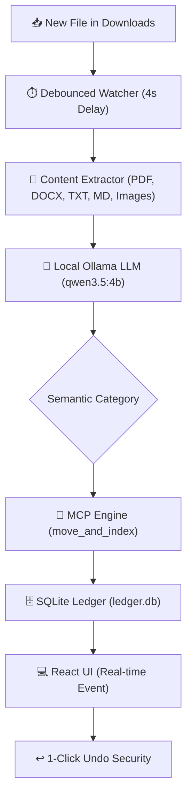

# Filemind 📁🧠
> **Privacy-First, 100% Local AI File Sorting Engine powered by Tauri v2, Rust & Ollama.**

Filemind is an open-source desktop application that automatically organizes your `Downloads` directory into structured, intelligent category folders using local Large Language Models (LLMs) and exposes a Model Context Protocol (MCP) server for Claude Desktop and Cursor IDE.

---

## 🏗️ Architecture & Pipeline



---

## ✨ Features

- 🔒 **100% Local & Private**: No files or text ever leave your machine. Zero cloud API dependencies.
- 🧠 **Pure AI Semantic Classification**: Uses local Ollama LLM (`qwen3.5:4b`) to understand document content rather than rigid extension rules.
- ⚡ **Tauri v2 + Rust Core**: High-performance Rust backend with minimal memory footprint.
- 🔌 **Model Context Protocol (MCP)**: Native JSON-RPC tool definitions (`extract_content`, `move_and_index`) for Cursor IDE & Claude Desktop integration.
- ↩️ **1-Click Undo Security**: Every file movement is stored in a Write-Ahead Logging (WAL) SQLite database with instant restoration.
- 🌐 **Modern Dark UI**: Sleek design system built with React, TypeScript, and TailwindCSS.

---

## 🚀 Quick Start

### 1. Download Filemind

Download the pre-compiled installer for your operating system from the **[Releases](https://github.com/Dhruv-Mann/filemind/releases)** page:
- 🪟 **Windows**: `filemind.exe`
- 🍏 **macOS**: `filemind.dmg`

### 2. Install Local Ollama Model

Filemind requires [Ollama](https://ollama.com/) running locally on `http://localhost:11434`:

```bash
# Pull the default 4B model
ollama pull qwen3.5:4b
```

---

## 🛠️ Local Development

### Prerequisites
- [Node.js v20+](https://nodejs.org/)
- [Rust Stable](https://www.rust-lang.org/tools/install)
- [Ollama](https://ollama.com/)

### Running the Desktop App

```bash
# Clone the repository
git clone https://github.com/Dhruv-Mann/filemind.git
cd filemind

# Install dependencies
npm install

# Run Tauri desktop app in development mode
npm run tauri dev
```

### Running the Landing Page Website Locally

```bash
cd website
npm install
npm run dev
```

---

## 🔌 MCP Integration (Cursor / Claude Desktop)

To connect Filemind as an MCP server in Cursor IDE or Claude Desktop, add this to your MCP configuration:

```json
{
  "mcpServers": {
    "filemind": {
      "command": "filemind",
      "args": []
    }
  }
}
```

---

## 📜 License & Author

Built with ❤️ by **[Dhruv Mann](https://github.com/Dhruv-Mann)**.  
Licensed under the [MIT License](LICENSE).
